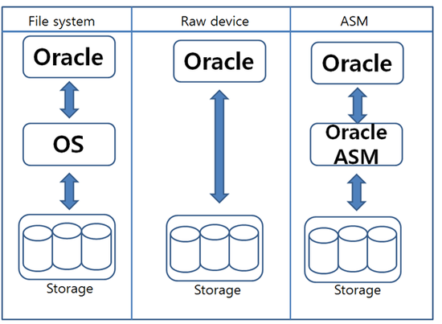
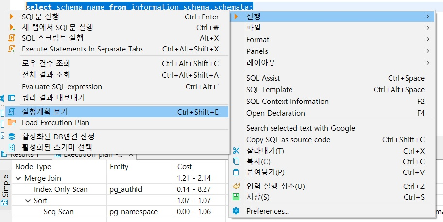
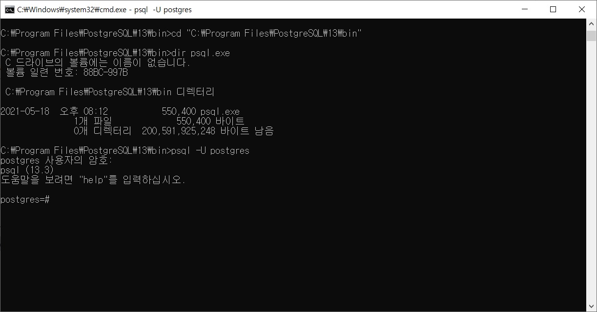
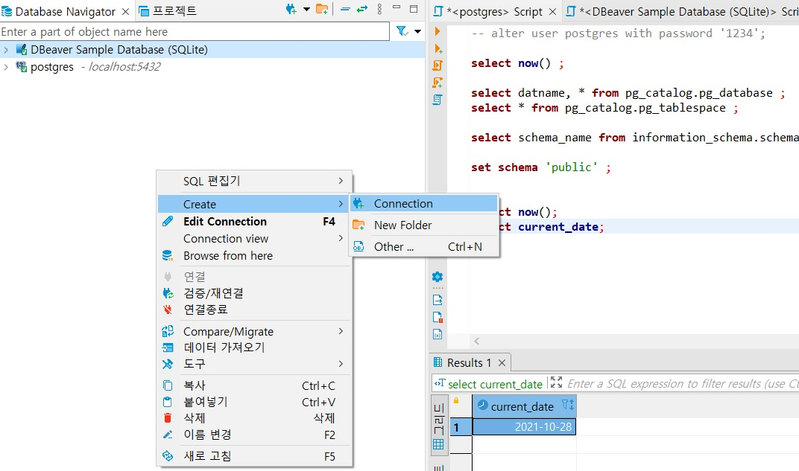
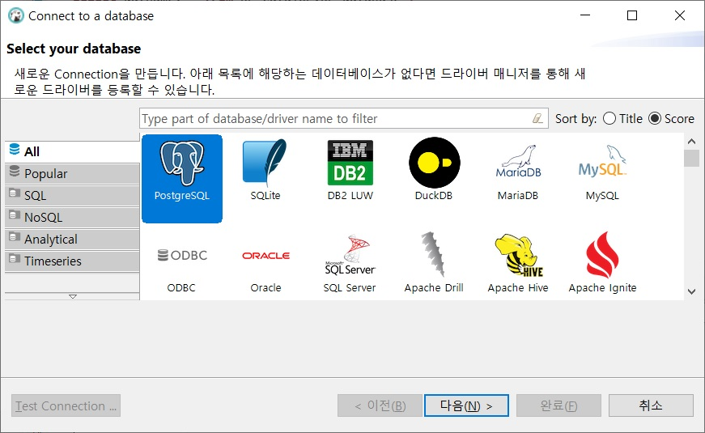
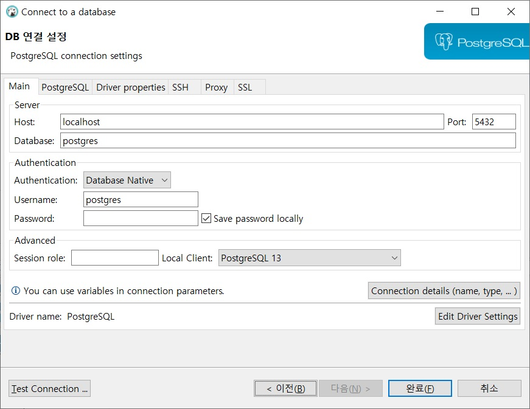

# SQL강좌 1일차    
---    
# 1.배경 
# 1.1 데이터베이스 소개 
> 데이터베이스는 관련정보의 집합이다. 
> 데이터베이스 시스템은 종이대신 전산화된 자료로 데이터를 저장함으로써 더 빠르게 검색하고, 다양한 방법으로 데이터를 색인화 하며, 최신 정보를 사용자에게 제공할 수 있습니다. 

## 1.1.1 비관계형 데이터베이스 시스템 
### File System vs DBMS
|구분|File System|DBMS|
|:----:|:---:|:---:|
|Cost|Low|High|
|Data Redundancy|O|X|
|Constraint|X|O|
|Data Dependency|O|X|
|**Multi User Access**|X|O|
|Security|파일단위의 접근 권한|세분화된 권한 부여 가능|
|Recovery|Difficult|There’s a way though…|

### File System Oracle 


## 1.1.2 관계형 모델 - RDBMS :: Relational DataBase Management System
> 1970년 IBM 연구소의 **에드거 프랭크 커드** 박사는 '대규모 공유 데이터 뱅크를 위한 데이터의 관계형 모델'이라는 논문을 발표하고 데이터를 테이블 집항으올 나타낼 것을 제안했습니다.    
> 테이블 **엔티티**는 **기본키**를 또는 복합키를 가지며 특성에 따라 자연키, 대리키로 구분 할 수 있다. 관계형데이터베이스에서 **참조키**(외래키)를 사용하여 Join 명령어로 엔티티간의 관계를 정의한다.    
> 각각의 독립적인 정보가 한 위치에만 저장되도록 데이터베이스 설계를 수정하는 절차를 **정규화**라고 합니다.    

# 1.2 SQL 
> SEQUEL이라 불리는 언어가 등장했으며 이것을 짧게 **SQL**이라 부르게 되었습니다.    
> 1980년 중반, 미국 국립 표준 연구소(American National Standards Institute::ANSI)에서 SQL언어의 최조 표준을 발표했습니다. 
> SQL이 'Structured Query Language'를 의미한다고 주장하는 사람이 많지만, SQL은 어떤 단어의 약어가 아니다. 
> S.Q.L이라 하거나 sequel(시퀄)이라고 함. 

## 1.2.1 SQL문 분류 
1. DDL – Data Definition Language : CREATE   
2. DQl – Data Query Language : SELECT   
3. DML – Data Manipulation Language : UPDATE   
4. DCL – Data Control Language : GRANT   
5. DTL - Data Transaction Language : COMMIT    

## 1.2.2 비절차적 언어인 SQL   
> SQL의 실행은 옵티마이저라는 데이터베이스 엔진에서 담당함.   
> 사용자가 직접 힌트를 지정함으로써 옵티마이저의 결정에 영향을 줄 수 있음. (PostgreSQL 엔트프라이즈 DB와 같은 힌트기능 없음)    



## 1.2.3 SQL 예제 
> SELECT  하나 이상의 칼럼 정의   
> FROM    하나 이상의 테이블 정의    
> WHERE   하나 이상의 조건 지정     

# 1.3 MySQL - PostgreSQL 
+ 오라클 : 오라클데이터베이스, Oracle v5 Client/Server 지원     
+ 마이크로소프트 : SQL 서버 (SQL Server - Sybase Server(ASE::Adaptive Server Enterprise)    
+ IBM : DB2 
+ 오픈소스 관계형 데이터베이스 : MySQL(Sun>Oracle), PostgreSQL, MariaDB 

---   

# 2. 데이터베이스 생성과 데이터 추가 
# 2.1 데이터베이스 생성    
```
create database [database name];   
create schema study ;   -- 생성후 SQL로 확인 
``` 
  + PostgreSQL 설치   
  + DBeaver 설치 
  + dvdrental 샘플 db 생성 
  
# 2.2 command 명령어 도구 사용 방법    
+ 콘솔실행 
  1. 윈도에서 cmd 명령으로 콘솔창 실행 
  2. 디렉토리 변경 
  ```
  cd "C:\Program Files\PostgreSQL\13\bin" 
  ```
  3. psql 실행 
  ```
  psql -U postgres   
  ```
  4. select 실행 
  ```
  select now(); 
  ```   
  
 

# 2.3 자료형    
참조문서 <https://www.postgresql.org/docs/14/multibyte.html>
## 2.3.1 문자 데이터   
> char(20)  - fixed-length    
> varchar(20)  - variable-length 
 
## 2.3.2 숫자 데이터   

|자료형|설명|
|:--:|--|
|tinyint|-128 ~ 127|
|smallint|-32,768 ~ 32,767|
|int|-2,147,483,648 ~ 2,147,483,647|
|float(p,s)|-38.402823466E+38 ~ -1.175494351-38   1.175494351-38 ~ 38.402823466E+38|

> float(4,2) 
> > 4 :: 소수점 아래 부분을 포함한 자리수    
> > 2 :: 소수점 아래 자리수 

## 2.3.3 시간 데이터    

|자료형|기본형식|
|:---:|---|
|date|YYYY-MM-DD|
|datetime|YYYY-MM-DD HH:MM:SS|
|timestamp|YYYY-MM-DD HH:MM:SS|

> timestamp :: 1970-01-01 ~ 2038-01-18 

# 2.4 테이블 생성   

> Entity를 1개 이상의 Attribute 표현한 것 
  
## 2.4.1 단계 1 : 설계 

+ 요구서 정의 및 분석   
+ Entity 선정, 객체(Object) 
  + Entity - COVID19 환자 
  + 속성 - 성별, 나이, 키, 몸무게 ....   

## 2.4.2 단계 2 : 정제    

+ 속성의 특성 및 자료 분석  
+ 중복 또는 복합열이 존재하지 않도록 정규화      

> DW(Data Warehouse), 연구 분석용 레지스트리는 역(반)정규화 

## 2.4.3 단계 3 : SQL 스키마 문 생성    

+ 테이블 정의서 작성    
+ DDL문을 작성    

> CREATE TABLE covid19 ( ... );   
> CREATE TABLE covid19_pop ( ... );   

``` 
-- study schema에 테이블 생성 
CREATE TABLE big ( 
  a INT          NOT NULL,
  b CHAR(3)      NOT NULL, 
  c VARCHAR(3)       NULL,
  d float(5,2)  DEFAULT 0, 
constraint pk_big primary key(a)
); 
``` 

```
-- [SHOW DATABASES]
SELECT datname FROM pg_database;

-- [SHOW TABLES]
SELECT table_name FROM information_schema.tables WHERE table_schema = 'study';

-- [SHOW COLUMNS]
SELECT column_name FROM information_schema.columns WHERE table_name = 'big';
``` 

**NULL**이란?    
1. 알 수 없는 항목    
2. count 되지 않는 항목    
3. 공백과 다른 의미    
4. 비교 연산자 또는 IF 문에서 처리되지 않는다.  
5. 테이블의 칼럼 정의시 NULL 허용 유무를 정의할 수 있다.    
6. IFNUL, ISNULL, is null 등으로 확인 가능하다. 

# 2.5 테이블 수정 
```
alter table big modify a SERIAL; 
```

## 2.5.1 데이터 삽입  
## 2.5.2 데이터 수정   
## 2.5.3 데이터 삭제    
# 2.6 좋은 구문을 망치는 경우 
# 2.6.1 고유하지 않은 기본 키    
# 2.6.2 존재하지 않는 외래 키   
# 2.6.3 열 값 위반   
# 2.6.4 잘못된 날짜 변환   
# 2.7 샤키라 데이터베이스 

---

# Install PostgreSQL :: Database Server 
1. 설치 파일 다운로드 :   
  <https://www.enterprisedb.com/downloads/postgres-postgresql-downloads> 
2. 설치 파일 실행 :  
  postgresql-14.0-1-windows-x64.exe 
3. 환경설정 파일   
  C:\Program Files\PostgreSQL\13\data 
  
|File Name|Description| 
|-----|-----|
|pg_hba.conf|ip대역별 접근권한을 설정한다. (Host Base Authentication)|
|pg_ident.conf|사용자 계정별 접근권한을 설정한다. (pg_hba.conf method설정에 따라)|
|postgresql.conf|서버환경 설정을 한다. 기본포트는 5432|

# Install DBeaver :: SQL Tool  
1. 설치 파일 다운로드 :
  <https://dbeaver.io/download/> 
2. 설치 파일 실행 :   
  dbeaver-ce-21.2.3-x86_64-setup.exe    
**※ 설치시 인터넷이 연결되어 있어야 드라이브 설치가 원활합니다.** 

# Connect Database 
1. 메뉴 열기 
  
2. 데이터베이스 선택 
  
3. 연결 설정후 완료 
  
