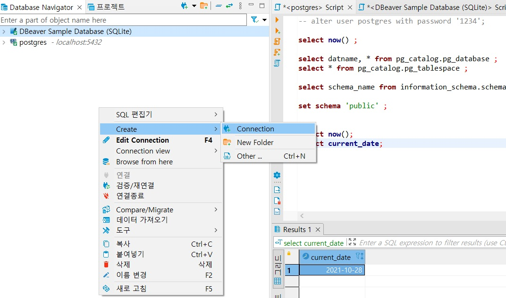
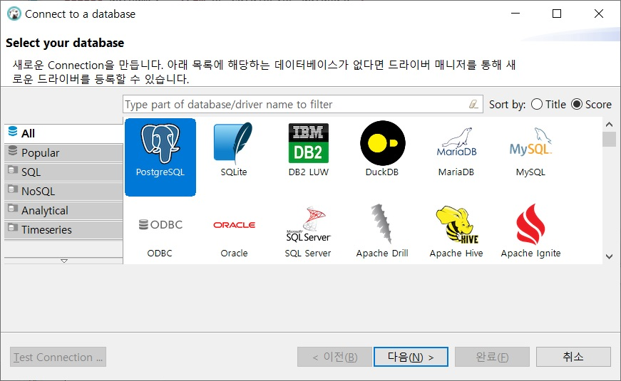
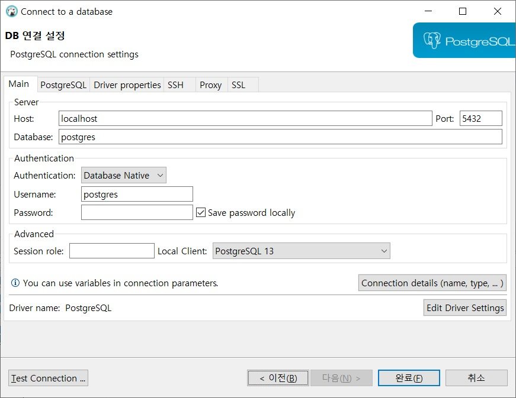

# File System vs DBMS
|구분|File System|DBMS|
|:----:|:---:|:---:|
|Cost|Low|High|
|Data Redundancy|O|X|
|Constraint|X|O|
|Data Dependency|O|X|
|**Multi User Access**|X|O|
|Security|파일단위의 접근 권한|세분화된 권한 부여 가능|
|Recovery|Difficult|There’s a way though…|

# Install PostgreSQL :: Database Server 
1. 설치 파일 다운로드 :   
  <https://www.enterprisedb.com/downloads/postgres-postgresql-downloads> 
2. 설치 파일 실행 :  
  postgresql-14.0-1-windows-x64.exe 
3. 환경설정 파일   
  C:\Program Files\PostgreSQL\13\data 
  
|File Name|Description| 
|-----|-----|
|pg_hba.conf|ip대역별 접근권한을 설정한다. (Host Base Authentication)|
|pg_ident.conf|사용자 계정별 접근권한을 설정한다. (pg_hba.conf method설정에 따라)|
|postgresql.conf|서버환경 설정을 한다. 기본포트는 5432|

# Install DBeaver :: SQL Tool  
1. 설치 파일 다운로드 :
  <https://dbeaver.io/download/> 
2. 설치 파일 실행 :   
  dbeaver-ce-21.2.3-x86_64-setup.exe    
**※ 설치시 인터넷이 연결되어 있어야 드라이브 설치가 원활합니다.** 

# Connect Database 
1. 메뉴 열기 
  
2. 데이터베이스 선택 
  
3. 연결 설정후 완료 
  
