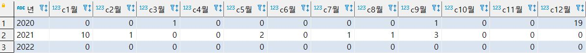
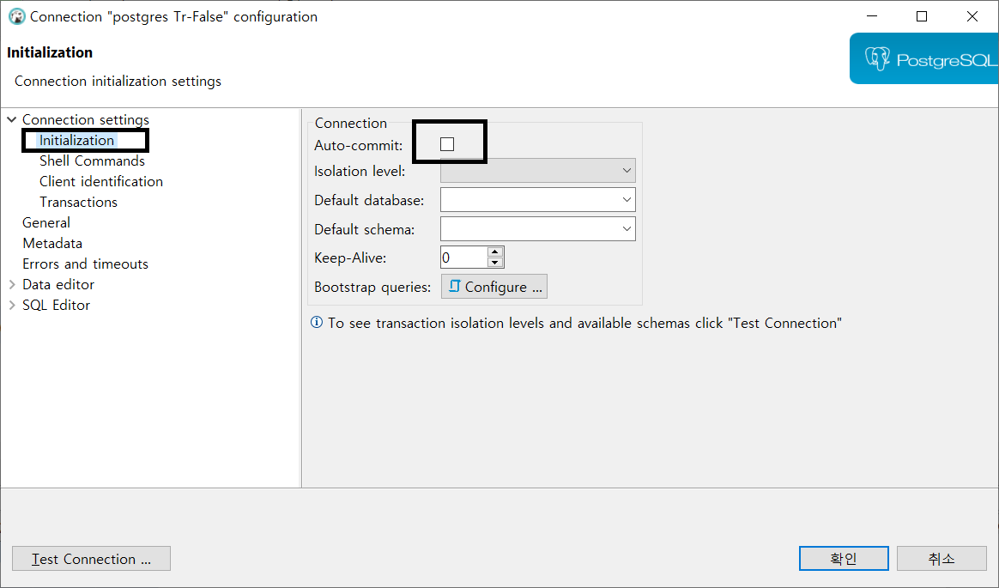
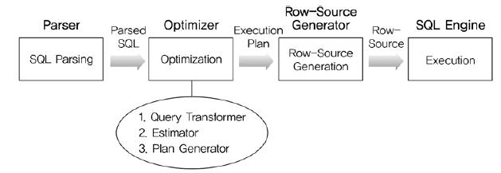

# 3 일차 
# 실습 자료 만들기 
``` 
-- 테스트 테이블 생성 
-- table a 
-- drop table a ;
create table a (
c1 int not null primary key, 
c2 char(1) not null, 
c3 varchar null,
c6 char(1) null 
);
-- table b 
--drop table b;
create table b (
c1 int not null, 
c2 char(1) not null, 
c3 varchar null,
c4 decimal(5,2) null,
c5 date default now(),
c6 char(1) null, 
constraint pk_b primary key(c1, c2)  
);
-- insert data to a 
insert into a 
values 
(1, 'a', '가', 'M'),
(2, 'b', '나', 'F'),
(3, 'c', '다', 'M'),
(4, 'd', '라', 'F'),
(5, 'e', '마', 'M'),
(6, 'f', '바', 'F');
-- insert data to b 
insert into b (c1, c2, c3, c4, c6 )
values 
(1, '1', 'a', 1.1, '남'),
(1, '2', 'a', 1.2, '남'),
(2, '1', 'b', 2.1, '여'),
(4, '1', 'd', 4.1, '여'),
(6, '1', 'f', 0.0, '여'),
(6, '2', 'f', 6.1, '여'),
(6, '3', 'f', 6.2, null),
(7, '1', null, 7.1, '남');

select * from a ;
select * from b ;

select a.*, b.* 
from a inner join b on (a.c1 = b.c1); 

select a.*, b.* 
from a join b on (a.c1 = b.c1);

select a.*, b.* 
from a left outer join b on (a.c1 = b.c1)
order by 1 ;
``` 
---
# 10 조인의 심화   
## 10.1 Outer Join 
``` 
-- 10.1 문제 1 covid19 테이블과 pop_covid19 테이블을 join하여 입원 한사람 중 100세 이상이면서 여자인 사람의 pat_sbst_no, ent_date, sex, age, adm_date를 조회하시오.   
select b.pat_sbst_no, b.ent_date, a.sex, a.age, a.adm_date 
from covid19 a join pop_covid19 b on (a.pat_sbst_no = b.pat_sbst_no)
where b.ward = 'I' and a.age >= 100 and a.sex = 'F';

-- 10.1 문제 2 covid19 테이블과 pop_covid19 테이블을 join하여 생활치료센터에 입소 경험이 있는 25세 남자의 pat_sbst_no, ent_date, sex, age, adm_date를 조회하시오.
select b.pat_sbst_no, b.ent_date, a.sex, a.age, a.adm_date
from covid19 a join pop_covid19 b on (a.pat_sbst_no = b.pat_sbst_no and b.ward = 'L')
where a.age = 25 and a.sex = 'M';

-- 10.1 문제 3 입원한 사람중 19세 환자의 대체번호와 나이, 입원일자를 모두 조회하고 생활치료센터의 입소하였던 내원일자 이력을 표시하시오. 
select a.pat_sbst_no, a.age, a.adm_date, b.ent_date 
from covid19 a left outer join pop_covid19 b on (a.pat_sbst_no = b.pat_sbst_no and b.ward = 'L')
where a.age = 19 ;
``` 
### 10.1.1 Left, Right Join 
``` 
-- 사망정보 테이블 생성 
--drop table covid19_death ;
create table COVID19_DEATH ( 
PAT_SBST_NO varchar(9) not null, 
DEATH_YN char(1) not null, 
DEATH_YMD date not null, 
constraint pk_covid_death primary key (PAT_SBST_NO)
); 
-- csv 자료 가져오기 
select * from covid19_death;
``` 
### 10.1.2 3 way outer join 
## 10.2 교차 조인 
``` 
select a.*, b.* 
from a cross join b ;
``` 
## 10.3 자연 조인 
```  
-- 건수를 비교해 보고 Query Plan을 확인해보시오. 
select count(1) 
from covid19 a natural join pop_covid19 b ;

select count(1) 
from covid19 a join pop_covid19 b on (a.pat_sbst_no = b.pat_sbst_no);
``` 
## 10.4 학습 점검 
### 10.4.1 실습 10-1 
### 10.4.2 실습 10-2 
### 10.4.3 실습 10-3 
# 11 조건식   
## 11.1 조건식 
## 11.2 case 표현식 - p.274 
> case 표현식은 SQL 문법에 내장되어 있으며, select, insert, update, delete 문에 포함될 수 있습니다. 
## 11.2.1 검색에서의 case 문 
``` 
case 
  when 조건1 then 값1 
  when 조건2 then 값2 
  when 조건3 then 값3 
  ... 
  when 조건n then 값n 
  [ELSE 값] 
end 
```
- select 구문안에 case 문 
- 사망자중 생활치료센터 입소 유무 구분 
```
select a.*,  
       case when exists (select 1 from pop_covid19 c where c.pat_sbst_no = a.pat_sbst_no and c.ward = 'L') then '생황치료센터입소'
            else '생활치료센터입소없음' 
       end as 상태 
from covid19_death a 
``` 

## 11.3 case 표현식의 예 
```
-- Tip 날짜에서 월 변환하기 
select to_char(now(), 'YYYY-MM');

-- 문제1 월별 사망자 수를 구하시오.  
select to_char(death_ymd, 'YYYY-MM') as 월, count(1) as 사망자수 
from covid19_death 
group by 1
order by 1;

-- 문제2 월별 사망자 수를 구하고 사망자가 없는 월은 0으로 표시하시오. 
-- 문자 '2021.11.11'를 date로 변환 
select '2021.11.11'::date ;
select date '2020.01.01';
select cast('2021.01.01' as date);
-- 문자 '2021.11.11'를 timestamp로 변환 
select '2021.11.11'::timestamp ;
-- 가상의 범위값 생성 1에서 9 
select generate_series(1, 9);
-- 기간내 월을 생성 
select GENERATE_SERIES((date '2020.01.01')::timestamp,(date '2021.12.31')::timestamp, interval '1 month');

select to_char(t.t, 'YYYY-MM') as 월, count(a.death_ymd) as 사망자수 
from (select GENERATE_SERIES((date '2020.01.01')::timestamp,(date '2021.12.31')::timestamp, interval '1 month') as t) t 
      left outer join covid19_death a 
      on (to_char(t.t, 'YYYY-MM') = to_char(death_ymd, 'YYYY-MM'))
group by 1
order by 1;
``` 
### 11.3.1  pivot  p.278  
-- 문제3 아래 그림과 같이 월별 사망자 수를 구하고 사망자가 없는 월은 0으로 표시하시오. 
  

### 11.3.3 나누기 오류 
```
select 11/0 ;  

select c1/c4 from b ;

-- 문제 4 0으로 나누면 오류가 발생합니다. 오류가 나지 않게 나누기 하고 모든 값을 나열하시오. 
select b.*, case when c4 != 0 then c1/c4 end as div 
from b ; 
-- 문제 5 문제 4번에서 나눈값의 소수점 2자리까지 표현하고 반올림 하시오. 
select b.*, case when c4 != 0 then round(c1/c4,2) end as div 
from b ;
-- 문제 6 문제 4번에서 나눈값의 소수점 2자리까지 표현하고 절사 하시오. 
select b.*, case when c4 != 0 then trunc(c1/c4,2) end as div 
from b ;
```  
### 11.3.4 조건부 업데이트 
```
select case when c6 = 'M' then '남'
            when c6 = 'F' then '여' end 
from a 
;

-- update 구분 
update 테이블명 
set 칼럼명 = 변경하고자하는값 
where 조건 ;

-- 문제 7 a 테이블의 c6를 M은 남 F는 여 로 변경하시오. 
update a 
set c6 = (case when c6 = 'M' then '남'
               when c6 = 'F' then '여' end) 
;

select * from a ;
``` 
### 11.3.5 Null 
```
-- null인 경우 모두 'F'로 됨 
select a.c1, a.c6, b.c6  
from a join b on (a.c1 = b.c1) 
where a.c6 = (case when b.c6 = '남' then 'M'
                   else 'F' end);  
-- null인 경우 누락                    
select a.c1, a.c6, b.c6  
from a join b on (a.c1 = b.c1) 
where a.c6 = (case when b.c6 = '남' then 'M'
                   when b.c6 = '여' then 'F' end)   
; 
``` 
## 11.4 학습 점검 
### 11.4.1 실습 11-1 
### 11.4.2 실습 11-2 
# 12 트랜젝션   
> transaction 테스트 환경구성을 위해서 아래와 같이 설정을 진행합니다. 
> DBeaver에서 PostgreSQL에 연결돤 데이터베이스 connection을 추가로 복사하고 설정을 아래와 같이 변경. (나머지 동일) 
   
## 12.1 다중 사용자 데이터베이스 
- Autocommit 를 False로 설정하여 접속한 connection에서 새로운 script 창을 생성합니다. 
- script 창에 아래 1 과 2 를 차례대로 실행합니다. 
- 3 script는 실행하지 않아야 하며, 3 script를 실행하기 전까지는 a테이블의 c6 항목의 페이지가 locking된 상태로 
- 유지됩니다. 
- 4 번 script를 Autocommit True가 되어 있는 창에서 실행해 봅니다. 
- 결과가 어떻게 보이는지 확인 합니다. 
- 다시 script 3을 Autocommit False가 되어 있는 창에서 결과를 조호해보고 Rollback한 후 결과를 확인합니다. 
``` 
-- 1 
update a 
set c6 = (case when c6 = 'M' then '남'
               when c6 = 'F' then '여' end) 
;
-- 2 
select * from a;

-- 3
rollback ;
``` 
- 기존 창에서 a 테이블의 값이 변경되었는지 확인 
``` 
-- 4 
select * from a; 
``` 

### 12.1.1 lock  p.288 
- 앞에서 테스트한 환경에서 동일한 Update 구문을 Autocommit False 창에서 먼저 실행하고 
- Autocommit True 창에서 다시 실행하면 어떤 현상이 발생되지 확인을 합니다.    
### 12.1.2 lock의 단위   
> table lock : 테이블 단위의 lock 관리 
> page lock : 동일한 페이지 단위의 lock을 관리(page size 2kb ~ 16kb) 
> row lock : 하나의 행에 대해 lock 관리 
> column lock : column 단위 lock 
## 12.2 트랜잭션   
- 트랜잭션의 완료는 commit, rollback 입니다. 
- commit는 수행한 모든 작업을 database에 적용하며 
- rollback는 이전까지 수행한 모든 작업을 작업시작전으로 되돌려 놓습니다. 
## 12.3 학습 점검 
``` 
-- transaction 학습점검 

delete from a ;

select * from a ;

rollback ;

select * from study.a ;

-- save point 
select * from a ;

begin ;

update a 
set c3 = 'A'
where c3 = '가'; 

select * from a ;

savepoint tran1 ;

update a 
set c3 = 'B'
where c3 = '나';

select * from a;

rollback to savepoint tran1;

select * from a;

commit ; 

select * from a ;

-- 복구 
update a 
set c3 = '가'
where c3 = 'A'; 

commit ;

select * from a ;
``` 
### 12.3.1 실습 12-1 
# 13 인덱스와 제약조건   p.299 
## 13.1 인덱스 
> 옵티마이저 
   
|항목|규칙 기반 옵티마이저|비용 기반 옵티마이저|
|:--:|----|----|
|개념|사전에 정의된 규칙 기반|최소비용 계산 실행계획 수립|
|기준|실행우선 순위|액세스 비용|
|인덱스|인덱스 존재시 가장 우선시 사용|Cost에 의한 결정|
|성능|사용자 SQL작성 숙련도|옵티마이저 예측 성능|
|장점|판단이 매우 규칙적 실행 예상가능|통계 정보를 통한 현실 요소 적용|
|단점|예측 통계정보 요소 무시|최소 성능 보장 계획의 예측 제어 어려움|
|사례|AND 중심 양쪽 '='시 Index Merge 사용|AND 중심 양쪽 '='시 분포도별 Index 선택| 

  

- Parser : SQL문장을 분석하여 문법 검사와 구성요소를 파악하고 이를 파싱 해서 파싱 트리를 만듭니다.
- Query Transformer : 파싱된 SQL을 보고 같은 결과를 도출하되, 좀 더 나은 실행 계획을 갖는 SQL로 변환이 가능한지를 판단하여 변환 작업을 수행합니다. 
- Estimator : 시스템 통계정보를 딕셔너리로부터 수집하여 SQL을 실행할 때 소요되는 총비용을 계산합니다.
- Plan Generator : Estimator를 통해 계산된 값들을 토대로 후보군이 되는 실행계획을 도출합니다. 
- Row-Source Generator : 옵티마이저가 생성한 실행계획을 SQL 엔진이 실제 실행할 수 있는 코드나 프로시저 형태로 포맷팅 합니다.
- SQL Engine : SQL을 실행합니다.

### 13.1.1 
> index 생성 
```
create index idx_covid19 on covid19 (adm_date);   
-- 다중 index 
create index idx_covid19_adm on covid19 (adm_date, disch_date);   
```   
## 13.2 제약조건 
## 13.3 학습 점검 
### 13.3.1 실습 13-1 
### 13.3.2 실습 13-2 
# 14 뷰   
## 14.1 뷰 
``` 
create view summary as (
select to_char(ent_date, 'YYYY') as 년도, count(1) as 전체건수, 
       sum(case when to_char(ent_date, 'MM') = '01' then 1 end) as c1월,
       sum(case when to_char(ent_date, 'MM') = '02' then 1 end) as c2월,
       sum(case when to_char(ent_date, 'MM') = '03' then 1 end) as c3월,
       sum(case when to_char(ent_date, 'MM') = '04' then 1 end) as c4월,
       sum(case when to_char(ent_date, 'MM') = '05' then 1 end) as c5월,
       sum(case when to_char(ent_date, 'MM') = '06' then 1 end) as c6월,
       sum(case when to_char(ent_date, 'MM') = '07' then 1 end) as c7월,
       sum(case when to_char(ent_date, 'MM') = '08' then 1 end) as c8월,
       sum(case when to_char(ent_date, 'MM') = '09' then 1 end) as c9월,
       sum(case when to_char(ent_date, 'MM') = '10' then 1 end) as c10월,
       sum(case when to_char(ent_date, 'MM') = '11' then 1 end) as c11월,
       sum(case when to_char(ent_date, 'MM') = '12' then 1 end) as c12월
from study.pop_covid19
group by to_char(ent_date, 'YYYY')
order by 1 asc 
);

select * from summary ;
``` 
## 14.2 뷰를 사용하는 이유 
### 14.2.1 데이터 보안 
> 보안이 필요한 컬럼이나 정보를 제한하여 정의할 수 있음.
### 14.2.1 데이터의 집계 
### 14.2.3 복잡성 숨기기 
### 14.2.4 
> Union 으로 병합하여 뷰테이블 생성 
## 14.3 갱신 가능한 뷰 
## 14.4 학습 점검 
### 14.4.1 실습 14-1 
### 14.4.2 실습 14-2 
# 15 메타데이터   
[PostgreSQL Metadata](https://www.postgresql.org/docs/9.1/catalogs.html) 

```  
select * from pg_catalog.pg_tables where tablename = 'covid19';

select table_schema,
       table_name,
       ordinal_position as position,
       column_name,
       data_type,
       case when character_maximum_length is not null
            then character_maximum_length
            else numeric_precision end as max_length,
       is_nullable,
       column_default as default_value
from information_schema.columns
where table_schema not in ('information_schema', 'pg_catalog')
and table_name = 'covid19'
order by table_schema, 
         table_name,
         ordinal_position;
```          
         
## 15.1 데이터에 관한 데이터 
## 15.2 정보 스키마 
## 15.3 메타데이터로 작업하기 
## 15.4 학습점검 
### 15.4.1 실습 15-1 
### 15.4.2 실습 15-2 
# 16 분석함수   
## 16.1 분석 함수의 개념 
### 16.1.1 데이터 윈도우 
``` 
select c.abo, round((count(1) / t.total::decimal) * 100, 2)||' %'  
from study.covid19 c  
     cross join (select count(1) as total from study.covid19 
        where abo is not null and abo != '') as t 
where c.abo is not null and c.abo != ''
group by c.abo, t.total;

-- abo가 null 또는 공백제외 
select abo, count(1) as cnt 
from covid19 
where abo is not null and abo != ''
group by abo ;

-- 16.1.1 데이터 윈도우를 사용하여 전체 건수 칼럼추가 p.353
select abo, count(1) as cnt, sum(count(1)) over() as total  
from covid19 
where abo is not null and abo != ''
group by abo ;

-- 문제 1 abo별 전체대비 비율을 구하시오. 

```    
### 16.1.2 로컬 정렬 
## 16.2 순위 
``` 
-- rank(), row_number(), dense_rank()  
select * from b ;

select c1, c2, rank() over(), row_number() over() 
from b ;

select c1, c2, rank() over(order by c1), 
               row_number() over(partition by c1),
               dense_rank() over(order by c1)
from b ;
```   
### 16.2.1 순위 함수
### 16.2.2 다양한 순위 생성 
## 16.3 리포팅 함수  
### 16.3.1 윈도우 프레임 
### 16.3.2 lag() 함수와 lead() 함수 
> 이전값, 이후값 추출 
### 16.3.3 group_concat() 함수 
## 16.4 학습 점검 
### 16.4.1 실습 16-1 
### 16.4.2 실습 16-2 
### 16.4.3 실습 16-3 

