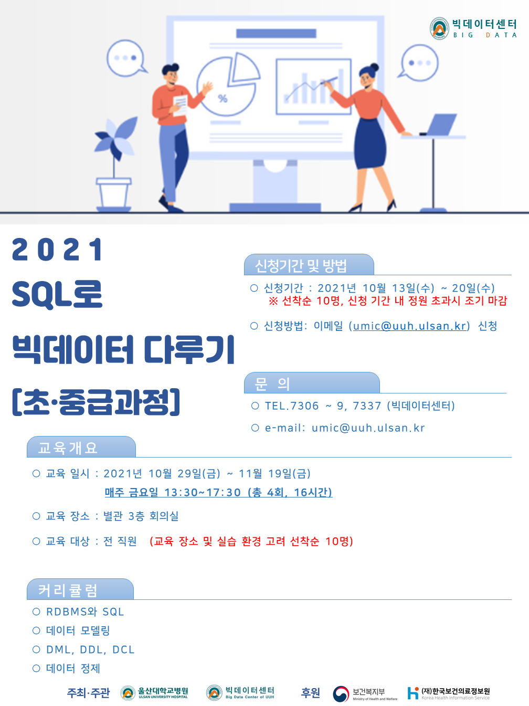
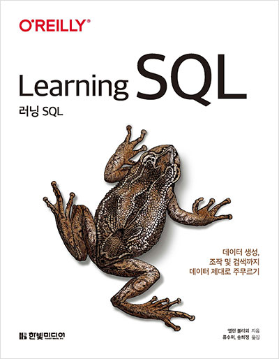

# 빅데이터센터 SQL-Study
   
--- 
### 1일차 교육 
1. 배경    
2. 데이터베이스 생성과 데이터 추가    
3. 쿼리입문   

+ Database와 File 시스템 
+ Database 설치 
+ SQL Tools 설치 
+ 데이터베이스 연결 
+ SQL 이란 

### 2일차 교육    
4. 필터링   
5. 다중 테이블 쿼리    
6. 집합 연산자   
7. 데이터 생성, 조작과 변환   
8. 그룹화와 집계   
9. 서브쿼리    

+ 데이터 모델링 

### 3일차 교육    
10. 조인의 심화   
11. 조건식   
12. 트랜젝션   
13. 인덱스와 제약조건   
14. 뷰   
15. 메타데이터   
16. 분석함수   

+ DML, DDL, DCL 

### 4일차 교육 
17. 대용량 데이터베이스 작업 
18. SQL과 빅데이터 

+ 데이터 정제

## PostgreSQL Document 
+ https://www.postgresql.org/docs/14/

## Learnning SQL 

